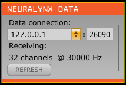

# Neuralynx Input Plugin

Plugin for the Open Ephys GUI to read data from Nerualynx systems such as ATLAS and Digital Lynx SX. These systems have a non-publicly-documented duplicated data output that sends UDP packets containing neural data during acquisition. This plugin is a data thread that receives these packets and sends them into an Open Ephys signal chain.

Requirement updated: No NDA signing required by anyone to use this plugin.

## Setup

### Hardware

An ATLAS or Digital Lynx SX system consists of an acquisition amplifier connected via a fiber optic Ethernet cable to a computer workstation running the Pegasus or Cheetah software (respectively). (For an ATLAS setup, these are both typically mounted on a portable stand.) Using this plugin for Open Ephys, you can process the same data on another computer using an Open Ephys signal chain without interfering with the Neuralynx-provided workstation and acquisition software at all.

To do so, you must connect the second optical data port on the rear of the amplifier to your computer running Open Ephys via gigabit Ethernet. A faster transfer speed will enable lower-latency closed-loop operation (if that is a goal), and a higher throughput will allow more channels to be processed without dropping packets. You can make the connection using just a fiber cable and a fiber-optic Ethernet adapter, or you can convert to copper wire Ethernet through a high-performance switch with a fiber interface such as [this one](https://www.amazon.com/NETGEAR-Gigabit-Ethernet-Managed-Technical/dp/B07L644PRY/ref=sr_1_9?keywords=netgear%2Bswitch%2Bgigabit%2Bfiber&qid=1552576135&refinements=p_n_condition-type%3A2224371011%2Cp_89%3ANETGEAR&rnid=2528832011&s=electronics&sr=1-9&th=1).

### Network configuration

The UDP packets on the second data port are simply duplicated from those sent from the primary port to the workstation, and are addressed to a specific IP and MAC address. Thus, your connection to the second data port on the computer running Open Ephys must be configured to receive these packets. The last 2 pages of `connection_config.pdf` in this repository give some details of how to do this on Windows and Ubuntu.

First, you need to find the workstation's MAC address. In a command prompt, run `ipconfig /all`. If there are multiple connections listed, find the one corresponding to the local area conection to the amplifier. The MAC address should be reported as the "Physical Address." Also confirm that the IPv4 address is 192.168.3.100, which is the default and typically should not change. If it is different though, also make note of it.

Then, you need to configure the connection on your computer by cloning this MAC address and setting a static IP address. Make sure you have established an Ethernet connection to the 2nd data port.

On Ubuntu or other Linux, you should be able to use the network settings GUI to configure a static/manual IP address of 192.168.3.100 (or other address noted earlier) and MAC address matching the workstation's. See the last page of `connection_config.pdf` for how to do this on Ubuntu Unity.

On Windows, you can set a static IP address as follows:
 1. Open the Network Connections control panel
 2. Right-click on the connection to the amplifier and click Properties
 3. Click "Internet Protocol Version 4 (TCP/IPv4)," then the Properties button
 4. Select "Use the following IP address" and enter 192.168.3.100 or the other address noted earlier.
 
You can clone the MAC address as follows:
 1. Open Device Manger
 2. Expand "Network adapters" and find the device that is connected to the 2nd data port
 3. Right-click and open Properties of this device. Switch to the Advanced tab.
 4. Select the Network Address property, then on the right side select "Value" and enter the MAC address from the workstation, without hyphens. Click OK.

### Software installation

This plugin can be built outside of the main Open Ephys GUI file tree using CMake. In order to do so, it must be in a sibling directory to plugin-GUI\* and the main GUI must have already been compiled.

You should use this branch if you are already using CMake to build the *main GUI* (in development as of writing). Otherwise, use the `master` branch.

See `NeuralynxInput/CMAKE_README.txt` and/or the wiki page [here](https://open-ephys.atlassian.net/wiki/spaces/OEW/pages/1259110401/Plugin+CMake+Builds) for build instructions.

\* If you have the GUI built somewhere else, you can specify its location by setting the environment variable `GUI_BASE_DIR` or defining it when calling cmake with the option `-DGUI_BASE_DIR=<location>`.

## Usage:

With a typical configuration, if the network connection is configured as described above, the plugin should "just work" - when acquisition has started and data is flowing, it should turn from gray to orange and "Not receiving" should be replaced with "Receiving:" and information about the number of channels and sample rate.

The combo box under "Data connection" lists the IP addresses corresponding to network connections on your computer. If you have properly set a static IP address for your connection as described above, it should be selectable here, and if it is the default of 192.168.3.100, this should already be selected by default.

To the right of the IP address is the port number. Again, this has a default of 26090 which typically would not change. (If the IP address and port are different from the defaults though, they should be listed in a file on the workstation called `DigitalLynxSX.cfg` or `ATLAS.cfg` as `%dataIPAddress` and `%dataPortNumber`.)

The sample rate is not sent directly with the data, but rather inferred based on the rate at which packets are received. If it is lower than expected, this is a hint that you may have too many channels for the throughput of your connection. However, sometimes temporary issues with the socket can cause the sample rate to be incorrect. You can try clicking the "refresh" button to re-assess the sample rate.
